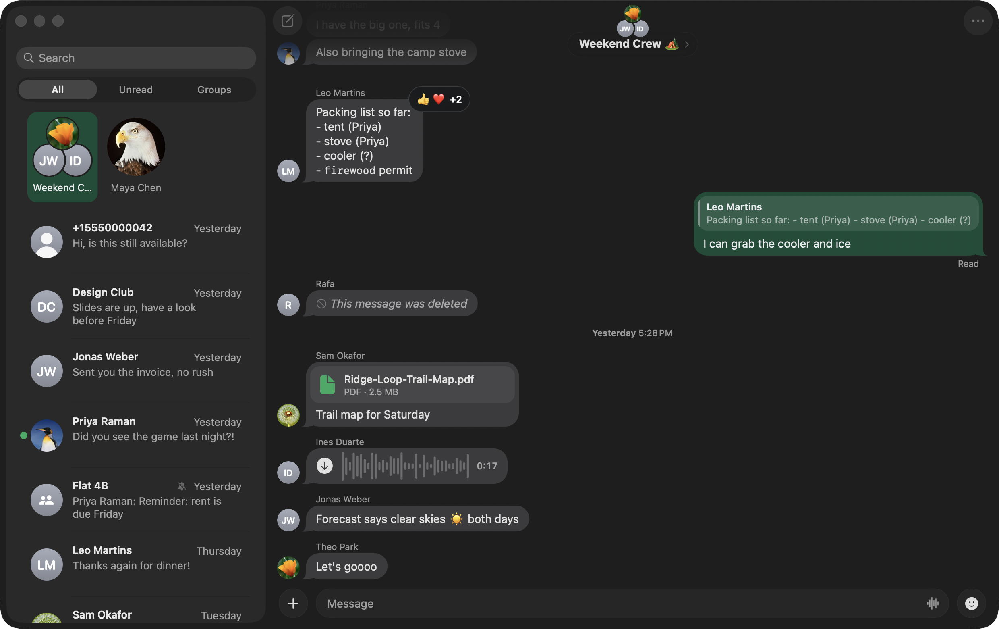

# Backchannel

A native Mac app for WhatsApp.

It opens in under half a second with your chats already on screen, uses under 0.2% CPU while it waits, and the whole app is 21 MB. WhatsApp's own Mac app is 657 MB.

> Unofficial. Not affiliated with WhatsApp or Meta. WhatsApp can ban accounts it sees using unofficial clients. Backchannel links to your phone the way WhatsApp Web does, over the official multi-device companion protocol (through [whatsmeow](https://github.com/tulir/whatsmeow)). That keeps the risk low, but it isn't zero.



*Sample chats from the preview database, not real ones.*

## Download

[Get the latest release](https://github.com/aritropaul/backchannel/releases/latest). It runs on macOS 26 Tahoe on Apple silicon. It's signed with Developer ID and notarized by Apple, so it opens like any other app.

On first launch, scan the code with your phone (Settings › Linked Devices › Link a Device), or link with your phone number instead. Your phone stays the main device, as it does with WhatsApp Web.

Versions after 0.2 update themselves. Once a day Backchannel checks for a new release and offers to install it, and Backchannel › Check for Updates… checks straight away. 0.2 and earlier can't, so download the next version by hand once.

## Fast and light

Measured on a 16 GB M5 MacBook, next to WhatsApp for Mac 26.37.76:

| | Backchannel | WhatsApp for Mac |
|---|---|---|
| App size | 21 MB (a 9.2 MB download) | 657 MB |
| Memory, idle | 91 MB | 262 MB (195 MB for the app, plus 37 MB and 30 MB for two extensions) |
| CPU, idle | 0.03–0.17% | 0.75–8.3% |
| Launch to a usable window | 0.3–0.5 s, with chats, photos and the last conversation drawn | 1.0–1.6 s warm and 2.5 s cold, with placeholder photos |

The two apps were measured side by side: memory and size on 3 October 2026, idle CPU on 2 and 3 October, launch time on 2 October after a reboot. On the same Mac, a one-letter search across 89,000 messages takes 7–9 ms, and the first sync brought in 123,000 messages of history in about 7 seconds.

Most of the difference is in how it's built:

- There's no web view. The interface is AppKit, and the WhatsApp protocol (whatsmeow, written in Go) is linked into the same process, so there's no browser engine and no second process to talk to.
- The interface never waits on the network. The protocol side writes to a local SQLite database and the interface reads it directly, so launching or switching chats draws from disk straight away.
- A message you send appears at once. Its row is written before the network round trip.
- Updates say what changed rather than carrying the data, and bursts are batched (10 ms in the core, at most eight sidebar reloads a second), so a busy group doesn't keep the CPU awake.

## What it does

It looks and moves like Messages: a glass sidebar, pinned chats as large avatars that fold into a compact column, bubbles with tails, and springs on sending, receiving, typing and reacting. Your accent colour runs through all of it, WhatsApp green by default. WhatsApp's own behaviour stays the same: delivery and read ticks, groups, replies, reactions, and `*bold*` `_italic_` `~strike~` formatting.

- Your full history from the phone, searchable across every chat or inside one.
- Text, replies, edits, reactions and delete for everyone. Right-click a message for Messages' reaction bar, or swipe it sideways with two fingers to reply.
- Photos in a viewer that grows out of the bubble, videos that play in place, voice notes you can record and play, documents, audio, contacts, polls, events and the camera.
- Stickers: everything sent in your chats, your favourites, and your own, cut out of a photo with background removal. GIF search works with your own GIPHY key.
- Pin, mute and archive. Pull the chat list down to reveal Archived; archived chats stay quiet.
- Lock a chat behind Touch ID. Give each chat its own wallpaper and bubble colour.
- Notifications and a dock badge.
- WhatsApp's settings: profile, privacy, blocked contacts, the default disappearing-message timer and linked devices.

## What it doesn't do

- Voice and video calls. They stay on your phone.
- Status and Channels.
- View-once photos and videos. WhatsApp never sends them to linked devices.
- Animated (Lottie) stickers. They show a placeholder.
- Usernames, two-step verification and reporting, which whatsmeow doesn't support.
- Syncing a few things that only live on this Mac: chat themes, locked chats, and stickers you favourite here.
- Intel Macs and macOS before 26.

And it's unofficial; see the note at the top.

## Build and run

```sh
make          # Go core (c-archive) + Xcode Release build -> build/Backchannel.app
make run      # build and open
make dmg      # build/Backchannel-<version>.dmg with the branded window (needs create-dmg)
```

Requirements: Xcode 26, Go 1.26, xcodegen (`brew install xcodegen`). `make project` regenerates `app/Backchannel.xcodeproj` from `app/project.yml`. The app icon is an Icon Composer document, `app/Icon/Backchannel.icon`.

Your data lives in `~/Library/Application Support/Backchannel/` (`session.db` holds the keys, `app.db` holds chats and messages, plus `media/`, `avatars/` and `core.log`).

Coming from a build named WA: the first launch quits if WA is still running, then copies WA's settings, backs up `session.db` and `app.db` to `Application Support/Backchannel backup <date>/`, moves the data folder, and repoints the stored file paths (avatars, media, stickers). The phone stays linked.

## Releasing

```sh
make release VERSION=0.2.0
```

That archives the app, signs it with Developer ID through Xcode's account (the Apple ID signed in under Xcode › Settings › Accounts; Xcode manages the certificate in the cloud, so there's no certificate file, password or secret), sends it to Apple's notary service through the same account, staples the ticket, packs the branded DMG, checks it with Gatekeeper, signs the DMG for updates and writes `appcast.xml`, and publishes `v0.2.0` on GitHub with the DMG, its SHA-256 and the appcast. The version comes from `VERSION`, the build number from the commit count. It releases only main as pushed with a clean tree; `PUBLISH=0 make release VERSION=0.2.0` does everything except publishing. The hardened runtime uses the entitlements in `app/Backchannel.entitlements` (camera, microphone and Photos).

Installed copies update through [Sparkle](https://sparkle-project.org). Once a day they read `appcast.xml` from the latest release, and they install a download only if its EdDSA signature matches the public key in `app/Sources/Info.plist` (`SUPublicEDKey`). The private key is in the login keychain, made once with Sparkle's `generate_keys --account backchannel`, and the first release asks whether `sign_update` may use it. Keep a copy somewhere safe (`generate_keys --account backchannel -x <file>`): without it, installed copies can't be updated.

Actions › Test build › Run workflow (`.github/workflows/release.yml`, a `macos-26` runner with Xcode 26.3) makes an ad-hoc signed test build on a clean machine and keeps it as an artifact for a week.

## Architecture

```
core/ (Go, -buildmode=c-archive)        app/Sources (Swift, AppKit)
  whatsmeow client + session.db           Core.swift      C bridge: WAStart / WACall / events
  events.go  → writes app.db (WAL)        Store.swift     read-only SQLite on the main thread
  actions.go ← JSON commands              MessageLayout   measured/drawn bubbles (TextKit 1)
  emits {"t":"msgs"/"chats"/...}          *ViewController NSTableView transcript + sidebar
```

- **The UI never waits on the network.** Go writes to `app.db`; Swift reads it directly with the system `SQLite3`. Both sides link the system `libsqlite3` (`-tags "libsqlite3 sqlite_omit_load_extension"`), because two SQLite copies touching one file can corrupt it.
- **Events say what changed, not the data.** Bursts are coalesced on the Go side (10 ms) and the sidebar reloads at most 8 times a second.
- **Sends echo locally.** The row is written before the network round trip.
- **Identities are canonicalised.** LID chats fold into the phone-number chat once the mapping is known.

## UI work without an account

```sh
python3 tools/make_preview_db.py build/preview
WA_PREVIEW_DIR=$PWD/build/preview build/Backchannel.app/Contents/MacOS/Backchannel          # synthetic chats, no network
WA_PREVIEW_DEMO=1 WA_SLOWMO=6 WA_PREVIEW_DIR=...                           # scripted send/typing/reply/tapback, 6× slow motion
```

## Licence

GPL-3.0; see [LICENSE](LICENSE). Backchannel links [libsignal for Go](https://github.com/tulir/libsignal-protocol-go), which is GPL-3.0, so the app as a whole is under the same licence. Everything else it's built on is listed with its licence in About Backchannel › Acknowledgements.
